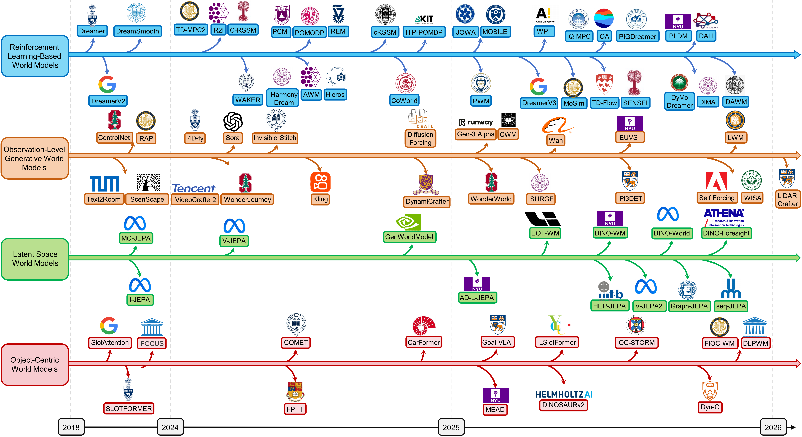
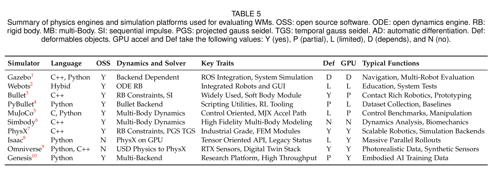
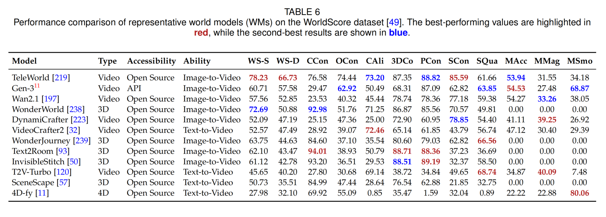

# Awesome-World-Models

[](http://arxiv.org/abs/$$$$$$) 
[](https://github.com/JiahuaDong/Awesome-World-Models)
[](https://github.com/JiahuaDong/Awesome-World-Models)
[]()

<!-- omit in toc -->
## 📢 Updates

- **2026.01**: 

<!-- omit in toc -->
## 👀 Introduction

Welcome to the repository for our survey paper, "Learning to Model the World: A Survey of World Models in Artificial Intelligence". This repository provides resources and updates related to our research. For a detailed introduction, please refer to [our survey paper]($$$$$$).

World models (WMs) provide a unified approach for modeling how environments evolve over time by learning predictive representations of states and observations. Recent advances in large-scale generative modeling and multimodal foundation models have substantially broadened their applicability across a wide range of interactive and multimodal domains; however, existing research remains fragmented across modeling paradigms, application domains, and evaluation protocols. This survey provides a systematic and in-depth review of WMs in artificial intelligence. Based on the world modeling paradigms of existing methods, we first categorize WMs into four major branches with formal mathematical formulations: reinforcement learning-based, observation-level generative, latent space, and object-centric world models. We further review a broad range of WM applications spanning robotics, autonomous driving, scientific discovery, virtual game simulation, GUI-based agents, as well as interpretability and trustworthiness, and summarize benchmark datasets, evaluation metrics, simulation platforms, and comparative results across WMs. Finally, we discuss key challenges, including long-horizon consistency, controllability, robustness, evaluation limitations, and generalization, and outline promising directions for future research. This survey aims to offer a unified reference for understanding, comparing, and advancing WMs.



The recent timeline of world models, covering core methods and the release of open-source and closed-source reproduction projects.

<!-- omit in toc -->
## 📒 Table of Contents

- [Awesome-World-Models](#awesome-world-models)
  - [Part 1: Reinforcement Learning-Based World Models](#part-1-reinforcement-learning-based-world-models)
  - [Part 2: Observation-Level Generative World Models](#part-2-observation-level-generative-world-models)
    - [Language Observations](#language-observations)
    - [Visual Observations](#visual-observations)
    - [3D and 4D Observations](#3d-and-4d-observations)
  - [Part 3: Latent Space World Models](#part-3-latent-space-world-models)
  - [Part 4: Object-centric World Models](#part-4-object-centric-world-models)
  - [Part 5: World Models for Robotics](#part-5-world-models-for-robotics)
    - [Manipulation](#manipulation)
      - [Visual Futrue Prediction](#visual-futrue-prediction)
      - [Latent Action State Imagination](#latent-action-state-imagination)
      - [Control-Oriented Planning](#control-oriented-planning)
      - [World Action Modeling](#world-action-modeling)
    - [Navigation](#navigation)
    - [Policy Learning](#policy-learning)
    - [Locomotion](#locomotion)
  - [Part 6: World Models for Autonomous Driving](#part-6-world-models-for-autonomous-driving)
    - [Predictive Modeling](#predictive-modeling)
    - [Action-Conditioned Imagination](#action-conditioned-imagination)
    - [Decision-Centric Integration](#decision-centric-integration)
  - [Part 7: World Models for Science](#part-7-world-models-for-science)
    - [Social Science and Socioeconomic Systems](#social-science-and-socioeconomic-systems)
    - [Physical and Natural Sciences](#physical-and-natural-sciences)
  - [Part 8: World Models for Virtual Game Simulation](#part-8-world-models-for-virtual-game-simulation)
    - [Pixel-Level Observation Prediction](#pixel-level-observation-prediction)
    - [3D Mesh-Level Observation Prediction](#3d-mesh-level-observation-prediction)
  - [Part 9: World Models for GUI-Based Agents](#part-9-world-models-for-gui-based-agents)
  - [Part 10: Interpretable and Trustworthy World Models](#part-10-interpretable-and-trustworthy-world-models)
  - [Part 11: Benchmark of World Models](#part-11-benchmark-of-world-models)
    - [Benchmark Datasets \& Evaluation Metrics](#benchmark-datasets--evaluation-metrics)
    - [Physics Engines \& Simulation Platforms](#physics-engines--simulation-platforms)
  - [Part 12: Performance Comparison](#part-12-performance-comparison)
  - [Citation](#citation)

## Part 1: Reinforcement Learning-Based World Models

* DreamerV3: Mastering diverse control tasks through world models [[Paper]](https://www.nature.com/articles/s41586-025-08744-2.pdf)   
*  Dreamer: Dream to control: Learning behaviors by latent imagination [[Paper]](https://iclr.cc/virtual_2020/poster_S1lOTC4tDS.html) 
* DreamSmooth: Improving model-based reinforcement learning via reward smoothing [[Paper]](https://iclr.cc/virtual/2024/poster/19014) 
* PlaNet: Learning latent dynamics for planning from pixels [[Paper]](https://icml.cc/virtual/2019/poster/3764) 
* DreamerV2: Mastering atari with discrete world models [[Paper]](https://iclr.cc/virtual/2021/poster/2742) 
* PIGDreamer: Privileged information guided world models for safe partially [[Paper]](https://icml.cc/virtual/2025/poster/44134) 
* HarmonyDream: Task Harmonization Inside World Models [[Paper]](https://icml.cc/virtual/2024/poster/32730) 
* DyMoDreamer: World modeling with dynamic modulation [[Paper]](https://neurips.cc/virtual/2025/loc/san-diego/poster/117925) 
* TD-MPC2: Scalable, robust world models for continuous control  [[Paper]](https://iclr.cc/virtual/2024/poster/18722) 
* Hieros: Hierarchical imagination on structured state space sequence world models [[Paper]](https://icml.cc/virtual/2024/poster/34428) 
* THICK: Learning hierarchical world models with adaptive temporal abstractions from discrete latent dynamics [[Paper]](https://iclr.cc/virtual/2024/poster/18558) 
* MoSim: Neural motion simulator pushing the limit of world models in reinforcement learning [[Paper]](https://cvpr.thecvf.com/virtual/2025/poster/34450) 
* R2I: Mastering memory tasks with world models [[Paper]](https://iclr.cc/virtual/2024/poster/19565) 

* LEQ: Model-based offline reinforcement learning with lower expectile q-learning [[Paper]](https://iclr.cc/virtual/2025/37540) 
* DIMA: Revisiting multi-agent world modeling from a diffusion-inspired perspective [[Paper]](https://neurips.cc/virtual/2025/loc/san-diego/poster/115775) 
* PCM: Policy-conditioned environment models are more generalizable [[Paper]](https://icml.cc/virtual/2024/poster/33439) 
* CoWorld: Making offline RL online: Collaborative world models for offline visual reinforcement learning [[Paper]](https://neurips.cc/virtual/2024/poster/93263) 
* IQ-MPC: Reward-free world models for online imitation learning [[Paper]](https://icml.cc/virtual/2025/poster/44035) 
* WAKER: Reward-free curricula for training robust world models [[Paper]](https://proceedings.iclr.cc/paper_files/paper/2024/hash/0a2b3e9107efed3d361b29f300a903ff-Abstract-Conference.html) 
* REM: Improving token-based world models with parallel observation prediction [[Paper]](https://icml.cc/virtual/2024/poster/34279) 
* cRSSM: Dreaming of many worlds: Learning contextual world models aids zero-shot generalization [[Paper]](https://openreview.net/pdf?id=zHt4K5zX4P) 
* Adaptive world models: Learning behaviors by latent imagination under non-stationarity $$$ [[Paper]](https://neurips.cc/virtual/2024/104950) 
* PWM: Policy learning with multi-task world models [[Paper]](https://iclr.cc/virtual/2025/poster/28766) 

## Part 2: Observation-Level Generative World Models

### Language Observations
*ByteSized32-State-Prediction: Can language models serve as text-based world simulators? $$$[[Paper]](https://aclanthology.org/2024.acl-short.1/) 
* GPT-4: Gpt-4 technical report [[Paper]](https://arxiv.org/pdf/2303.08774) 
* Llama 3: The llama 3 herd of models [[Paper]](https://arxiv.org/pdf/2407.21783) 
* LLMCWM: Language agents meet causality – bridging LLMs and causal world models [[Paper]](https://proceedings.iclr.cc/paper_files/paper/2025/hash/5c5bc3553815adb4d1a8a5b8701e41a9-Abstract-Conference.html) 
* Surge: On the potential of large language mode [[Paper]](https://aclanthology.org/2025.emnlp-main.162/) 
* RAP: Reasoning with language model is planning with world model [[Paper]](https://aclanthology.org/2023.emnlp-main.507/) 
* Making large language models into world models with precondition and effect knowledge [[Paper]](https://aclanthology.org/2025.coling-main.503.pdf) 
* LWM: World model on million-length video and language with blockwise ringattention [[Paper]](https://iclr.cc/virtual/2025/poster/30229) 
### Visual Observations
* Sora: Video generation models as world simulators [[Paper]](https://openai.com/index/video-generation-models-as-world-simulators/) 
* TeleWorld: Macro-from-Micro Planning for High-Quality and Parallelized Autoregressive Long Video Generation [[Paper]](https://arxiv.org/abs/2508.03334) 
* Gen-3 [[Blog]](https://runwayml.com/research/introducing-gen-3-alpha) 
* T2v-turbo: Breaking the quality bottleneck of video consistency model with mixed reward feedback [[Paper]](https://papers.nips.cc/paper_files/paper/2024/file/8a57aa8e8b57e64a42e95f7dceb0adb9-Paper-Conference.pdf) 
* Emu3: Next-token prediction is all you need [[Paper]](https://arxiv.org/pdf/2409.18869) 
* SPMEM: Video world models with long-term spatial memory [[Paper]](https://neurips.cc/virtual/2025/poster/118886) 
* Wan: Open and Advanced Large-Scale Video Generative Models [[Paper]](https://arxiv.org/pdf/2503.20314) 
* LLaVA: Visual instruction tuning [[Paper]](https://papers.neurips.cc/paper_files/paper/2023/hash/6dcf277ea32ce3288914faf369fe6de0-Abstract-Conference.html) 
* Vid2world: Crafting video diffusion models to interactive world models [[Paper]](https://arxiv.org/pdf/2505.14357) 
* VideoCrafter2: Overcoming data limitations for high-quality video diffusion models [[Paper]](https://cvpr.thecvf.com/virtual/2024/poster/29306) 
* IRASim: A Fine-Grained World Model for Robot Manipulation [[Paper]](https://iccv.thecvf.com/virtual/2025/poster/2655) 
* WISA: World simulator assistant for physics-aware text-to-video generation [[Paper]](https://neurips.cc/virtual/2025/loc/san-diego/poster/119925) 
* CoLA-World: Co-Evolving Latent Action World Models [[Paper]](https://arxiv.org/pdf/2510.26433)  
### 3D and 4D Observations
* 4D-fy: Text-to-4d generation using hybrid score distillation sampling [[Paper]](https://cvpr.thecvf.com/virtual/2024/poster/29662) 
* WonderJourney: Going from anywhere to everywhere [[Paper]](https://cvpr.thecvf.com/virtual/2024/poster/31689) 
* SceneScape: Text-driven consistent scene generation [[Paper]](https://proceedings.neurips.cc/paper_files/paper/2023/hash/7d62a85ebfed2f680eb5544beae93191-Abstract-Conference.html) 
* LiDARCrafter: Dynamic 4d world modeling from lidar sequences [[Paper]](https://arxiv.org/pdf/2508.03692v2) 
* Text2room: Extracting textured 3d meshes from 2d text-to-image models [[Paper]](https://openaccess.thecvf.com/content/ICCV2023/html/Hollein_Text2Room_Extracting_Textured_3D_Meshes_from_2D_Text-to-Image_Models_ICCV_2023_paper.html) 
* WonderWorld: Interactive 3d scene generation from a single image [[Paper]](https://cvpr.thecvf.com/virtual/2025/poster/33364) 
* Invisible Stitch: Generating smooth 3d scenes with depth inpainting [[Paper]](https://openreview.net/attachment?id=grImaQQkFx&name=pdf) 

## Part 3: Latent Space World Models
* I-JEPA: Self-supervised learning from images with a joint-embedding predictive architecture [[Paper]](https://cvpr.thecvf.com/virtual/2023/poster/21019) 
* V-JEPA: Revisiting Feature Prediction for Learning Visual Representations from Video [[Paper]](https://openreview.net/forum?id=L2pdpUFUaX) 
* V-JEPA 2: Self-Supervised Video Models Enable Understanding, Prediction and Planning [[Paper]](https://neurips.cc/virtual/2024/104556) 
* seq-JEPA: Autoregressive Predictive Learning of Invariant-Equivariant World Models [[Paper]](https://neurips.cc/virtual/2024/104556) 
* MC-JEPA: A Joint-Embedding Predictive Architecture for Self-Supervised Learning of Motion and Content Features [[Paper]](https://arxiv.org/abs/2307.12698) 
* DINO-WM: World Models on Pre-trained Visual Features Enable Zero-shot Planning [[Paper]](https://proceedings.mlr.press/v267/zhou25t.html) 
* DINO-world: Back to the Features: DINO as a Foundation for Video World Models [[Paper]](https://arxiv.org/abs/2507.19468) 
* DINO-Foresight: Looking into the Future with DINO [[Paper]](https://neurips.cc/virtual/2025/loc/san-diego/poster/116713) 
* World Models Group Latents: Learning Abstract World Models with a Group-Structured Latent Space [[Paper]](https://arxiv.org/abs/2506.01529) 

## Part 4: Object-centric World Models
* Object-centric Learning with Slot Attention [[Paper]](https://proceedings.neurips.cc/paper/2020/hash/8511df98c02ab60aea1b2356c013bc0f-Abstract.html) 
* SlotFormer: Unsupervised Visual Dynamics Simulation with Object-Centric Models [[Paper]](https://iclr.cc/virtual/2023/poster/11779) 
* FIOC-WM: Learning Interactive World Model for Object-Centric Reinforcement Learning [[Paper]](https://arxiv.org/abs/2511.02225) 
* G-SWM: Improving Generative Imagination in Object-Centric World Models [[Paper]](https://icml.cc/virtual/2020/poster/6582) 
* When Object-Centric World Models Meet Policy Learning: From Pixels to Policies, and Where It Breaks [[Paper]](https://arxiv.org/abs/2511.06136) 
* Objects matter: object-centric world models improve reinforcement learning in visually complex environments [[Paper]](https://arxiv.org/abs/2501.16443) 
* LSlotFormer: Object-Centric World Model for Language-Guided Manipulation [[Paper]](https://openreview.net/forum?id=29p13QihRM) 
* Compositional OCL: Unifying Causal and Object-centric Representation Learning allows Causal Composition [[Paper]](https://iclr.cc/virtual/2025/37564) 
* Dyn-O: Building Structured World Models with Object-Centric Representations [[Paper]](https://neurips.cc/virtual/2025/loc/san-diego/poster/117215) 
* MEAD: Efficient Exploration and Discriminative World Model Learning with an Object-Centric Abstraction [[Paper]](https://iclr.cc/virtual/2025/poster/28750) 
* Object-Centric Latent Action Learning [[Paper]](https://iclr.cc/virtual/2025/37546) 
* Object-Centric Representations Generalize Better Compositionally with Less Compute [[Paper]](https://iclr.cc/virtual/2025/37565) 
* CarFormer: Self-driving with Learned Object-Centric Representations [[Paper]](https://eccv.ecva.net/virtual/2024/poster/2110) 

## Part 5: World Models for Robotics

### Manipulation
#### Visual Futrue Prediction
* RoboDreamer: Learning Compositional World Models for Robot Imagination [[Paper]](https://proceedings.mlr.press/v235/zhou24f.html) 
* Grounding Video Models to Actions through Goal Conditioned Exploration [[Paper]](https://arxiv.org/abs/2411.07223) 
* ViPRA: Video Prediction for Robot Actions [[Paper]](https://arxiv.org/abs/2511.07732) 
* FlowDreamer: A RGB-D World Model with Flow-based Motion Representations for Robot Manipulation [[Paper]](https://arxiv.org/abs/2505.10075) 
* TesserAct: Learning 4D Embodied World Models [[Paper]](https://arxiv.org/abs/2504.20995) 
* ORV: 4D Occupancy-centric Robot Video Generation [[Paper]](https://arxiv.org/abs/2506.03079) 
* WristWorld: Generating Wrist-Views via 4D World Models for Robotic Manipulation [[Paper]](https://arxiv.org/abs/2510.07313) 
* Learning Video Generation for Robotic Manipulation with Collaborative Trajectory Control [[Paper]](https://arxiv.org/abs/2506.01943) 
* Vidar: Embodied Video Diffusion Model for Generalist Bimanual Manipulation [[Paper]](https://arxiv.org/abs/2507.12898) 
* LaDi-WM: A Latent Diffusion-based World Model for Predictive Manipulation [[Paper]](https://arxiv.org/abs/2505.11528) 
* KeyWorld: Key Frame Reasoning Enables Effective and Efficient World Models [[Paper]](https://arxiv.org/abs/2509.21027) 

#### Latent Action State Imagination
* Learning Latent Dynamics for Planning from Pixels [[Paper]](https://arxiv.org/abs/1811.04551) 
* FLARE: Robot Learning with Implicit World Modeling [[Paper]](https://arxiv.org/abs/2505.15659) 
* AdaWorld: Learning Adaptable World Models with Latent Actions [[Paper]](https://arxiv.org/abs/2503.18938) 
* DyWA: Dynamic World Adaptation for Generalizable World Models [[Paper]](https://arxiv.org/abs/2503.16806) 
* OSVI-WM: One-Shot Visual Imitation via World Models [[Paper]](https://arxiv.org/abs/2505.20425) 
* DEMO$^3$: Multi-Stage Manipulation with Demonstration-Augmented Reward, Policy, and World Model Learning [[Paper]](https://arxiv.org/abs/2503.01837) 
* Strengthening Generative Robot Policies through Predictive World Modeling [[Paper]](https://arxiv.org/abs/2502.00622) 
* In-Context Policy Improvement for Contact-Rich Manipulation with Pretrained Generative Models [[Paper]](https://arxiv.org/abs/2508.15021) 


#### Control-Oriented Planning
* Deep Reinforcement Learning in a Handful of Trials using Probabilistic Dynamics Models (PETS) [[Paper]](https://arxiv.org/abs/1805.12114) 
* TD-MPC: Temporal Difference Learning for Model Predictive Control [[Paper]](https://arxiv.org/abs/2203.04955) 
* TD-MPC2: Scalable, Robust World Models for Continuous Control [[Paper]](https://arxiv.org/abs/2310.16828) 
* Time-Aware World Model for Adaptive Prediction and Control (TAWM) [[Paper]](https://arxiv.org/abs/2506.08441) 
* Planning with Diffusion for Flexible Behavior Synthesis [[Paper]](https://arxiv.org/abs/2205.09991) 
* Decision Diffuser: Is Conditional Generative Modeling All You Need for Decision-Making? [[Paper]](https://arxiv.org/abs/2211.15657) 
* Potential-Based Diffusion Motion Planning [[Paper]](https://arxiv.org/abs/2407.06169) 
* HiP: Compositional Foundation Models for Hierarchical Planning [[Paper]](https://arxiv.org/abs/2309.08587) 
* PIVOT-R: Primitive-Driven Waypoint-Aware World Model for Robotic Manipulation [[Paper]](https://arxiv.org/abs/2410.10394) 
* Hdflow: Hierarchical diffusion-flow planning for long-horizon robotic assembl [[Paper]](https://openreview.net/forum?id=nokbt6AbcM) 
* ManipDreamer: Learning Manipulation World Models with Action-Tree Supervisions [[Paper]](https://arxiv.org/abs/2504.16464) 
* RoboHorizon: An LLM-Assisted Multi-View World Model for Long-Horizon Robotic Manipulation [[Paper]](https://arxiv.org/abs/2501.06605) 
* Mobile Manipulation with Active Inference [[Paper]](https://arxiv.org/abs/2507.17338) 

#### World Action Modeling

* Genie Envisioner: A Unified World Foundation Platform for Robotic Manipulation [[Paper]](https://arxiv.org/abs/2508.05635)  
* WoW: Towards a World Omniscient World Model through Embodied Interaction [[Paper]](https://arxiv.org/abs/2509.22642)  
* PAR: Physical Autoregressive Model for Robotic Manipulation without Action Pretraining [[Paper]](https://arxiv.org/abs/2508.09822)  
* iMoWM: Taming Interactive Multi-Modal World Model for Robotic Manipulation [[Paper]](https://arxiv.org/abs/2510.09036)  
* PhysicalAgent: Towards General Cognitive Robotics with Foundation World Models [[Paper]](https://arxiv.org/abs/2509.13903)  
* World4Omni: A Zero-Shot Framework from Image Generation World Model to Robotic Manipulation [[Paper]](https://arxiv.org/abs/2506.23919v1)  
### Navigation
* NWM: Navigation World Models [[Paper]](https://openaccess.thecvf.com/content/CVPR2025/papers/Bar_Navigation_World_Models_CVPR_2025_paper.pdf) 
* Kinodynamic: Kinodynamic Motion Planning for Mobile Robot Navigation across Inconsistent World Models [[Paper]](https://arxiv.org/abs/2509.26339) 
* Neuro-Symbolic: Perspective-Shifted Neuro-Symbolic World Models for Socially-Aware Robot Navigation [[Paper]](https://arxiv.org/abs/2503.20425) 
* Abs-Sim2Rea: Abstract Sim2Real through Approximate Information States [[Paper]](https://openreview.net/pdf?id=FoDmB0ixdt) 
* Unified WM: Unified world models: Memory-augmented planning and foresight for visual navigation [[Paper]](https://arxiv.org/pdf/2510.08713v1) 
* Scene Graph World: Imaginative World Modeling with Scene Graphs for Embodied Agent Navigation [[Paper]](https://arxiv.org/abs/2508.06990) 
* Scaling Inference-Time Search with Vision Value Model for Improved Visual Comprehension [[Paper]](https://arxiv.org/abs/2412.03704) 
* X-Mobility: End-To-End Generalizable Navigation via World Modeling [[Paper]](https://arxiv.org/pdf/2410.17491v3) 
* WMNav: Integrating Vision-Language Models into World Models for Object Goal Navigation [[Paper]](https://arxiv.org/abs/2503.02247) 
* RECON: Rapid Exploration for Open-World Navigation with Latent Goal Models [[Paper]](https://arxiv.org/abs/2104.05859) 
* NaVi-WM: Deductive Chain-of-Thought Augmented Socially-aware Robot Navigation World Model [[Paper]](https://arxiv.org/abs/2510.23509) 
* MindJourney: Test-Time Scaling with World Models for Spatial Reasoning [[Paper]](https://arxiv.org/abs/2507.12508) 
* NavMorph: A Self-Evolving World Model for Vision-and-Language Navigation in Continuous Environments [[Paper]](https://arxiv.org/abs/2506.23468) 
* Deep Active Inference with Diffusion Policy and Multiple Timescale World Model for Real-World Exploration and Navigation [[Paper]](https://arxiv.org/pdf/2510.23258v1) 
* World Model Implanting for Test-time Adaptation of Embodied Agents [[Paper]](https://arxiv.org/abs/2509.03956) 
* After Persistent Embodied WM: Learning 3D Persistent Embodied World Models [[Paper]](https://arxiv.org/abs/2505.05495) 

### Policy Learning
* WMPO: World Model-based Policy Optimization for Vision-Language-Action Models [[Paper]](https://arxiv.org/abs/2511.09515) 
* World4RL: Diffusion World Models for Policy Refinement with Reinforcement Learning for Robotic Manipulation [[Paper]](https://arxiv.org/abs/2509.19080) 
* DAWM: Diffusion Action World Models for Offline Reinforcement Learning via Action-Inferred Transitions [[Paper]](https://arxiv.org/abs/2509.19538) 
* Latent Action World Models for Control with Unlabeled Trajectories [[Paper]](https://arxiv.org/abs/2512.10016) 
* Prelar: World model pre-training with learnable action representation [[Paper]](https://link.springer.com/chapter/10.1007/978-3-031-73337-6_11) 
* World models can leverage human videos for dexterous manipulation [[Paper]](https://arxiv.org/abs/2512.13644) 
* TraceGen: World Modeling in 3D Trace Space Enables Learning from Cross-Embodiment Videos [[Paper]](https://arxiv.org/abs/2511.21690) 
* 3DFlowAction: Learning Cross-Embodiment Manipulation from 3D Flow World Model [[Paper]](https://arxiv.org/abs/2506.06199) 
* Ctrl-World: A Controllable Generative World Model for Robot Manipulation [[Paper]](https://arxiv.org/abs/2510.10125) 
* Robotic World Model: A Neural Network Simulator for Robust Policy Optimization in Robotics [[Paper]](https://arxiv.org/abs/2501.10100) 
* WorldGym: World Model as An Environment for Policy Evaluation [[Paper]](https://arxiv.org/abs/2506.00613) 
* Worldeval: World model as realworld robot policies evaluator [[Paper]](https://arxiv.org/abs/2505.19017) 
### Locomotion
* WMP: World Model-based Perception for Visual Legged Locomotion [[Paper]](https://wmp-loco.github.io/)   
* WMR: Learning Humanoid Locomotion with World Model Reconstruction [[Paper]](https://arxiv.org/abs/2502.16230) 
* World Model Predictive Control for Robust Locomotion [[Paper]](https://arxiv.org/abs/2408.14472) 
* Ego: Ego-Vision World Model for Humanoid Contact Planning [[Paper]](https://ego-vcp.github.io/) 

## Part 6: World Models for Autonomous Driving

### Predictive Modeling
* UniWorld: Autonomous Driving Pre-training via World Models [[Paper]](https://arxiv.org/abs/2308.07234) 
* HoloDrive: Holistic 2D-3D Multi-Modal Street Scene Generation for Autonomous Driving [[Paper]](https://arxiv.org/abs/2412.01407) 
* WoVoGen: World Volume-Aware Diffusion for Controllable Multi-camera Driving Scene Generation [[Paper]](https://link.springer.com/chapter/10.1007/978-3-031-72989-8_19/) 
* NeMo: Neural Volumetric World Models for Autonomous Driving [[Paper]](https://link.springer.com/chapter/10.1007/978-3-031-72643-9_12) 
* UnO: Unsupervised Occupancy Fields for Perception and Forecasting [[Paper]](https://ieeexplore.ieee.org/document/10658015) 
* Copilot4D: Learning Unsupervised World Models for Autonomous Driving via Discrete Diffusion [[Paper]](https://openreview.net/forum?id=Psl75UCoZM) 
* Renderworld: World Model with Self-Supervised 3D Label [[Paper]](https://ieeexplore.ieee.org/abstract/document/11127609) 
* DriveDreamer4D: World Models Are Effective Data Machines for 4D Driving Scene Representation [[Paper]](https://ieeexplore.ieee.org/abstract/document/11094017) 

### Action-Conditioned Imagination
* GAIA-1: A Generative World Model for Autonomous Driving [[Paper]](https://arxiv.org/abs/2309.17080) 
* WorldDreamer: Towards General World Models for Video Generation via Predicting Masked Tokens [[Paper]](https://arxiv.org/abs/2401.09985) 
* OccWorld: Learning a 3D Occupancy World Model for Autonomous Driving [[Paper]](https://link.springer.com/chapter/10.1007/978-3-031-72624-8_4) 
* DriveDreamer: Towards Real-World-Drive World Models for Autonomous Driving [[Paper]](https://link.springer.com/chapter/10.1007/978-3-031-73195-2_4) 
* Vista: A Generalizable Driving World Model with High Fidelity and Versatile Controllability [[Paper]](https://proceedings.neurips.cc/paper_files/paper/2024/hash/a6a066fb44f2fe0d36cf740c873b8890-Abstract-Conference.html) 
* Drive-WM: Driving Into the Future: Multiview Visual Forecasting and Planning with World Model for Autonomous Driving [[Paper]](https://ieeexplore.ieee.org/abstract/document/10655190) 
* DriveWorld: 4D Pre-Trained Scene Understanding via World Models for Autonomous Driving [[Paper]](https://ieeexplore.ieee.org/document/10655336) 
* InfinityDrive: Breaking Time Limits in Driving World Models [[Paper]](https://arxiv.org/abs/2412.01522) 
* DriveDreamer-2: LLM-Enhanced World Models for Diverse Driving Video Generation [[Paper]](https://ojs.aaai.org/index.php/AAAI/article/view/33130) 


### Decision-Centric Integration
* Think2Drive: Efficient Reinforcement Learning by Thinking with Latent World Model for Autonomous Driving (in CARLA-V2) [[Paper]](https://link.springer.com/chapter/10.1007/978-3-031-72995-9_9) 
* Doe-1: Closed-Loop Autonomous Driving with Large World Model [[Paper]](https://arxiv.org/abs/2412.09627) 
* AdaWM: Adaptive World Model based Planning for Autonomous Driving [[Paper]](https://openreview.net/forum?id=NEu8wgPctU) 
* DriveVLA-W0: World Models Amplify Data Scaling Law in Autonomous Driving [[Paper]](https://arxiv.org/abs/2510.12796) 

## Part 7: World Models for Science

### Social Science and Socioeconomic Systems
* SWM: Social World Models [[Paper]](https://arxiv.org/abs/2509.00559) 
* SWM-AP: Social World Model-Augmented Mechanism Design Policy Learning [[Paper]](https://neurips.cc/virtual/2025/loc/san-diego/poster/115517) 
* SocioVerse: A World Model for Social Simulation Powered by LLM Agents and a Pool of 10 Million Real-World Users [[Paper]](https://arxiv.org/abs/2504.10157) 
* TwinMarket: A Scalable Behavioral and Social Simulation for Financial Markets [[Paper]](https://neurips.cc/virtual/2025/loc/san-diego/poster/116676) 
* A Virtual Reality-Integrated System for Behavioral Analysis in Neurological Decline [[Paper]](https://iclr.cc/virtual/2025/37544) 
* Bidding for Influence: Auction-Driven Diffusion Image Generation [[Paper]](https://icml.cc/virtual/2025/49321) 
* Typhon: Effectively Designing 2-Dimensional Sequence Models for Multivariate Time Series [[Paper]](https://iclr.cc/virtual/2025/37514) 

### Physical and Natural Sciences
* CellFlux: Simulating Cellular Morphology Changes via Flow Matching [[Paper]](https://icml.cc/virtual/2025/poster/46535) 
* ODesign: A World Model for Biomolecular Interaction Design [[Paper]](https://arxiv.org/abs/2510.22304) 
* Medical world model: Generative simulation of tumor evolution for treatment planning [[Paper]](https://arxiv.org/abs/2506.02327) 
* CheXWorld: Exploring Image World Modeling for Radiograph Representation Learning [[Paper]](https://cvpr.thecvf.com/virtual/2025/poster/34038) 
* Xray2Xray: World Model from Chest X-rays with Volumetric Context [[Paper]](https://arxiv.org/abs/2506.03079) 
* EchoWorld: Learning Motion-Aware World Models for Echocardiography Probe Guidance [[Paper]](https://cvpr.thecvf.com/virtual/2025/poster/34389) 
* PINT: Physics-Informed Neural Time Series Models with Applications to Long-term Inference on WeatherBench 2m-Temperature Data [[Paper]](https://iclr.cc/virtual/2025/37537) 
* Reconstructing Dynamics from Steady Spatial Patterns with Partial Observations [[Paper]](https://iclr.cc/virtual/2025/35783) 
* HEP-JEPA: A foundation model for collider physics [[Paper]](https://iclr.cc/virtual/2025/33136) 

## Part 8: World Models for Virtual Game Simulation

### Pixel-Level Observation Prediction
* Diffusion For World Modeling: Visual Details Matter In Atari [[Paper]](https://neurips.cc/virtual/2024/poster/95428) 
* GameNGen: Diffusion Models Are Real-Time Game Engines [[Paper]](https://iclr.cc/virtual/2025/poster/29770) 
* Oasis: A Universe In A Transformer [[Paper]](https://oasis-model.github.io/) 
* AnimeGamer: Infinite Anime Life Simulation with Next Game State Prediction [[Paper]](https://iccv.thecvf.com/virtual/2025/poster/1518) 
* Matrix-Game 2.0: An Open-Source, Real-Time, And Streaming Interactive World Model [[Paper]](https://arxiv.org/abs/2508.13009) 
* Matrix-Game: Interactive World Foundation Model [[Paper]](https://arxiv.org/abs/2506.18701) 
* RealPlay: From Virtual Games To Real-World Play [[Paper]](https://arxiv.org/abs/2506.18901) 
* GameFactory: Creating New Games With Generative Interactive Videos [[Paper]](https://arxiv.org/abs/2501.08325) 

### 3D Mesh-Level Observation Prediction
* HunyuanWorld 1.0: Generating Immersive, Explorable, And Interactive 3D Worlds From Words Or Pixels [[Paper]](https://arxiv.org/abs/2507.21809) 
* Matrix-3D: Omnidirectional Explorable 3D World Generation [[Paper]](https://arxiv.org/abs/2508.08086) 

## Part 9: World Models for GUI-Based Agents
* NeuralOS: Towards Simulating Operating Systems via Neural Generative Models [[Paper]](https://arxiv.org/abs/2507.08800) 
* ViMo: A Generative Visual GUI World Model for App Agents [[Paper]](https://arxiv.org/abs/2504.13936) 
* Unlocking Smarter Device Control: Foresighted Planning With A World Model-Driven Code Execution Approach [[Paper]](https://arxiv.org/abs/2505.16422) 
* R-WoM: Retrieval-augmented World Model For Computer-use Agents [[Paper]](https://arxiv.org/abs/2510.11892) 
* WKM: Agent Planning With World Knowledge Model [[Paper]](https://neurips.cc/virtual/2024/poster/93977) 
* WebDreamer: Is Your LLM Secretly A World Model Of The Internet? Model-Based Planning For Web Agents [[Paper]](https://openreview.net/forum?id=c6l7yA0HSq) 
* WMA: Web Agents With World Models: Learning And Leveraging Environment Dynamics In Web Navigation [[Paper]](https://iclr.cc/virtual/2025/poster/28448) 
* WebSynthesis: World-Model-Guided MCTS for Efficient WebUI-Trajectory Synthesis [[Paper]](https://arxiv.org/abs/2507.04370) 
* WebEvolver: Enhancing Web Agent Self-Improvement with Coevolving World Model [[Paper]](https://arxiv.org/abs/2504.21024) 
* WALL-E 2.0: World Alignment by NeuroSymbolic Learning improves World Model-based LLM Agents [[Paper]](https://arxiv.org/abs/2504.15785) 
* SimuRA: A World-Model-Driven Simulative Reasoning Architecture for General Goal-Oriented Agents [[Paper]](https://arxiv.org/abs/2507.23773) 
* Dyna-Think: Synergizing Reasoning, Acting, and World Model Simulation in AI Agents [[Paper]](https://arxiv.org/abs/2506.00320) 

## Part 10: Interpretable and Trustworthy World Models
* General agents need world models [[Paper]](https://icml.cc/virtual/2025/poster/44620) 
* GPT：A Causal World Model Underlying Next Token Prediction: Exploring GPT in a Controlled Environment [[Paper]](https://arxiv.org/abs/2412.07446) 
* Stan&Terry：Transformers Use Causal World Models in Maze-Solving Tasks [[Paper]](https://iclr.cc/virtual/2025/37549) 
* MLP：When Do Neural Networks Learn World Models? [[Paper]](https://arxiv.org/abs/2502.09297) 
* LLMs：Linear spatial world models emerge in large language models. [[Paper]](https://arxiv.org/abs/2506.02996) 
* Mistral：Revisiting the othello world model hypothesis. [[Paper]](https://arxiv.org/abs/2503.04421) 
* GPT-2-style transformer：Scaling laws for pre-training agents and world models. [[Paper]](https://arxiv.org/abs/2411.04434) 
* VAE：How hard is it to confuse a world model? [[Paper]](https://arxiv.org/abs/2510.21232) 
* DeepSeek：Utilizing world models for adaptively covariate acquisition under limited budget for causal decision making. [[Paper]](https://iclr.cc/virtual/2025/37518) 
## Part 11: Benchmark of World Models

### Benchmark Datasets \& Evaluation Metrics
* Frozen in time: A joint video and image encoder for end-to-end retrieval. [[Paper]](https://openaccess.thecvf.com/content/ICCV2021/html/Bain_Frozen_in_Time_A_Joint_Video_and_Image_Encoder_for_ICCV_2021_paper.html) 
* Panda-70m: Captioning 70m videos with multiple cross-modality teachers. [[Paper]](https://openaccess.thecvf.com/content/CVPR2024/html/Chen_Panda-70M_Captioning_70M_Videos_with_Multiple_Cross-Modality_Teachers_CVPR_2024_paper.html) 
* Ego4d: Around the world in 3,000 hours of egocentric video. [[Paper]](https://openaccess.thecvf.com/content/CVPR2022/html/Grauman_Ego4D_Around_the_World_in_3000_Hours_of_Egocentric_Video_CVPR_2022_paper.html) 
* Howto100m: Learning a text-video embedding by watching hundred million narrated video clips. [[Paper]](https://openaccess.thecvf.com/content_ICCV_2019/html/Miech_HowTo100M_Learning_a_Text-Video_Embedding_by_Watching_Hundred_Million_Narrated_ICCV_2019_paper.html) 
* Worldscore:A unified evaluation benchmark for world generation. [[Paper]](https://arxiv.org/abs/2504.00983) 
* Open x-embodiment: Robotic Learning Datasets and RT-X Models : Open X-Embodiment Collaboration0. [[Paper]](https://ieeexplore.ieee.org/document/10611477) 
* Room-Across-Room: Multilingual vision-and-language navigation with dense spatiotemporal grounding. [[Paper]](https://aclanthology.org/2020.emnlp-main.356/) 
* Ewmbench: Evaluating scene, motion, and semantic quality in embodied world models. [[Paper]](https://arxiv.org/abs/2505.09694) 
* Meta-world: A benchmark and evaluation for multi-task and meta reinforcement learning. [[Paper]](https://arxiv.org/abs/1910.10897) 
* nuscenes: A multimodal dataset for autonomous driving. [[Paper]](https://openaccess.thecvf.com/content_CVPR_2020/html/Caesar_nuScenes_A_Multimodal_Dataset_for_Autonomous_Driving_CVPR_2020_paper.html) 
* ACT-Bench: Towards Action Controllable World Models for Autonomous Driving. [[Paper]](https://arxiv.org/abs/2412.05337) 
* Jump cell painting dataset: morphological impact of 136,000 chemical and genetic perturbations. [[Paper]](https://www.biorxiv.org/content/10.1101/2023.03.23.534023v1) 
* Random Forest Classifier：A machine learning modelto predict hepatocellular carcinoma response to transcatheter arterial chemoembolization.  [[Paper]](https://pubs.rsna.org/doi/full/10.1148/ryai.2019180021) 
* The arcade learning environment: An evaluation platform for general agents. [[Paper]](https://arxiv.org/abs/1207.4708) 
* Minerl: A large-scale dataset of minecraft demonstrations. [[Paper]](https://www.ijcai.org/proceedings/2019/339) 
* OSWorld: Benchmarking multimodal agents for open-ended tasks in real computer environments. [[Paper]](https://neurips.cc/virtual/2024/poster/97468) 
* Windows agent arena: Evaluating multi-modal OS agents at scale.  [[Paper]](https://icml.cc/virtual/2025/poster/45035) 
### Physics Engines \& Simulation Platforms

* Gazebo: Design and use paradigms for Gazebo, an open-source multi-robot simulator [[Paper]](https://ieeexplore.ieee.org/document/1389727) 
* WebotsTM: Professional Mobile Robot Simulation [[Paper]](https://arxiv.org/abs/cs/0412052) 
* Bullet Physics SDK [[github]](https://github.com/bulletphysics/bullet3)  [[Blog]](https://pybullet.org/wordpress/) 
* PyBullet Quickstart Guide [[SDK]](https://raw.githubusercontent.com/bulletphysics/bullet3/master/docs/pybullet_quickstartguide.pdf)  [[Blog]](https://pybullet.org/wordpress/) 
* MuJoCo [[github]](https://github.com/google-deepmind/mujoco)  [[Blog]](https://mujoco.readthedocs.io/en/stable/overview.html) 
* Simbody: multibody dynamics for biomedical research [[Paper]](https://www.sciencedirect.com/science/article/pii/S2210983811000241) 
* NVIDIA PhysX SDK [[SDK]](https://nvidia-omniverse.github.io/PhysX/physx/5.6.1/) 
* Isaac Gym: High Performance GPU-Based Physics Simulation For Robot Learning [[Paper]](https://arxiv.org/abs/2108.10470)  [[Blog]](https://sites.google.com/view/isaacgym-nvidia) 
* Omniverse [[Notion]](https://docs.omniverse.nvidia.com/dev-overview/latest/index.html)  [[SDK]](https://docs.omniverse.nvidia.com/materials-and-rendering/latest/rtx-renderer_pt.html) 
* Genesis: A Generative and Universal Physics Engine for Robotics and Beyond [[github]](https://genesis-embodied-ai.github.io/)  [[SDK]](https://genesis-world.readthedocs.io/en/latest/) 
## Part 12: Performance Comparison

## Citation
If you find this work useful, welcome to cite us.
```bib


```

<!-- omit in toc -->
## ⭐ Star History

<a href="https://github.com/JiahuaDong/Awesome-World-Models">
 <picture>
   <source media="(prefers-color-scheme: dark)" srcset="https://api.star-history.com/svg?repos=JiahuaDong/Awesome-World-Models&type=Date&theme=dark" />
   <source media="(prefers-color-scheme: light)" srcset="https://api.star-history.com/svg?repos=JiahuaDong/Awesome-World-Models&type=Date" />
   
 </picture>
</a>
